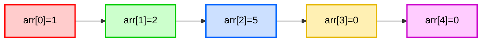
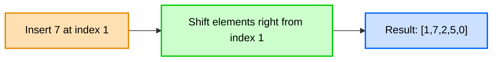
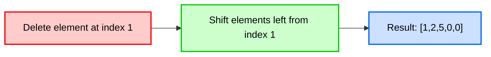

<h1 align="center">🚀 Java Data Structures Lab – Arrays Module</h1>


This repository contains all example code, lecture material, and student activities for the **Arrays Module** of the Java Data Structures Lab.  
The module focuses on understanding how arrays store data in contiguous memory, and why operations such as insertion and deletion require **shifting elements**.

This content prepares students for upcoming structures: **Linked Lists, Stacks, Queues, Trees, BSTs, and Sorting**.

---

## 📌 Module Objectives

Students will learn to:

- How arrays occupy **contiguous memory**
- Why indexing provides **O(1)** access time
- How to perform **insertion using right-shifting**
- How to perform **deletion using left-shifting**
- The difference between **capacity vs. logical size**
- Why arrays are inefficient for dynamic data changes

---

## ▶ Lecture Video

This repository corresponds to the recorded lecture:

[DS Lab: Arrays in Java – Insertion & Deletion Explained](https://www.youtube.com/watch?v=rMp0cFD1jcI)

---

## 📚 Lecture Chapter (PDF)

Additional slides used during the lecture:
**[Lecture 01 - Arrays.pdf](src/arrays/Lecture%2001%20-%20Arrays.pdf)**

Includes:

- What is an Array?
- Features of Arrays
- Advantages
- Limitations
- Example used in lecture  
- Notes for students

Students are encouraged to review and run it alongside `Arrays.java` for practice.

---

## 📁 Repository Structure

```bash
java-ds-lab-arrays/
│
├── src/
│   ├── examples/                 # Lecture example code
│   │   └── Arrays.java
│   │
│   ├── activities/               # Practice problems with solutions
│   │   ├── LargestandSmallest.java   # Find largest/smallest value and index
│   │   └── RotateLeft.java            # Rotate array left (shifting + reverse method)
│   │
│   └── chapters/                 # Lecture chapters (PDF)
│       └── Lecture 01 - Arrays.pdf
│
├── assignments/                  # Assignment descriptions & future solutions
│   └── README.md
│
└── README.md
```

---

## 💡 Key Concepts Demonstrated

### ✔ Contiguous Memory Layout

Arrays store elements sequentially in memory.
This enables **O(1) direct access** using the formula:

```bash
address(arr[i]) = base_address + (i * element_size)
```

> This provides **constant-time access**.

---

### 🖼 Array Memory Visualization



---

### ✔ Manual Shifting for Insertion

To insert at index i, elements from the end down to i must shift right:



---

### ✔ Manual Shifting for Deletion

To delete at index i, elements shift left:



---

## 🖼 Diagram: How Arrays Sit in Memory

Example: An `int[]` stored in contiguous memory, assuming each `int = 4 bytes`.

Base address = 2000

```bash
+-----------+-----------+-----------+-----------+-----------+
|  arr[0]   |  arr[1]   |  arr[2]   |  arr[3]   |  arr[4]   |
+-----------+-----------+-----------+-----------+-----------+
    2000        2004        2008        2012        2016
```

Access:

```bash
arr[0] → address 2000
arr[1] → address 2000 + 4 = 2004
arr[2] → address 2000 + 8 = 2008
```

Insertion at index 1 shifts all elements to the right:

```bash
Before:  [1, 2, 5, 0, 0]
Insert 7 at index 1
Shift →  [1, 2, 2, 5, 0]
Result → [1, 7, 2, 5, 0]
```

Deletion shifts left:

```bash
Before delete index 1: [1, 7, 2, 5, 0]
After shifting →        [1, 2, 5, 0, 0]
```

---

## 📘 Code Explanation

This project contains two core methods:

### ⭐ `insertElement(int[] arr, int element, int index, int size)`

- Rejects insertion if the array is full
- Validates index
- Shifts elements right
- Inserts the new value into its correct place

This demonstrates why static arrays cannot dynamically expand.

---

### ⭐ `deleteElement(int[] arr, int index, int size)`

- Validates index
- Shifts all elements left from the deleted position
- Clears the last logical element (`0`)

This shows logical deletion while keeping the fixed array structure intact.

---

## ▶ Example Execution

The `main` method demonstrates:

- Initializing an array
- Inserting a value
- Deleting a value
- Printing before/after states

This provides a full walkthrough of manual shifting operations.

---

## 📘 Activities (with Solutions)

The `[activities/](src/activities)` folder includes practice problems solved in class.

### ⭐ Activity 01 – Largest & Smallest Element

File: [src/activities/LargestandSmallest.java](src/activities/LargestandSmallest.java)

Demonstrates:

- Basic traversal
- Conditional selection
- Tracking indices of key values

---

### ⭐ Activity 02 – Rotate Array Left by 1 (Multiple Techniques)

File: [src/activities/RotateLeft.java](src/activities/RotateLeft.java)

Techniques shown:

- Shifting-based rotation (core arrays lesson)
- Using delete/insert logic
- Reverse-based rotation (faster O(n) approach)

> The reverse method is included for completeness but is not the primary focus of the Arrays module.

---

## ▶ Activity Solutions Video

Watch the Activity Solutions video for a detailed, step-by-step walkthrough of how to solve the activities from this module. The video explains the solutions for the problems covered in the Activities 01 & 02.

[Activity Solutions – Arrays Lecture (Largest & Smallest Elements, Rotate Left)](https://youtu.be/f2lLdk3ZZKc?si=j0E_b314OcoUVfvB)

---

## ▶ How to Run

Clone the repository:

```bash
git clone https://github.com/Maryam-Skaik/java-ds-lab-arrays.git
```

Open in NetBeans, VS Code, or IntelliJ, then run any file inside [src/examples/](src/examples/) or [src/activities/](src/activities/).

---

## 🎓 Learning Outcome

Students will understand:

- Why arrays require shifting
- Why many applications prefer **Linked Lists** for dynamic operations
- The difference between **physical size** (capacity) and **logical size**
- How memory layout influences data structure selection

These concepts are critical for success in the rest of the DS course.

---

## 📝 License

This project is provided for educational use in the Data Structures Lab.
